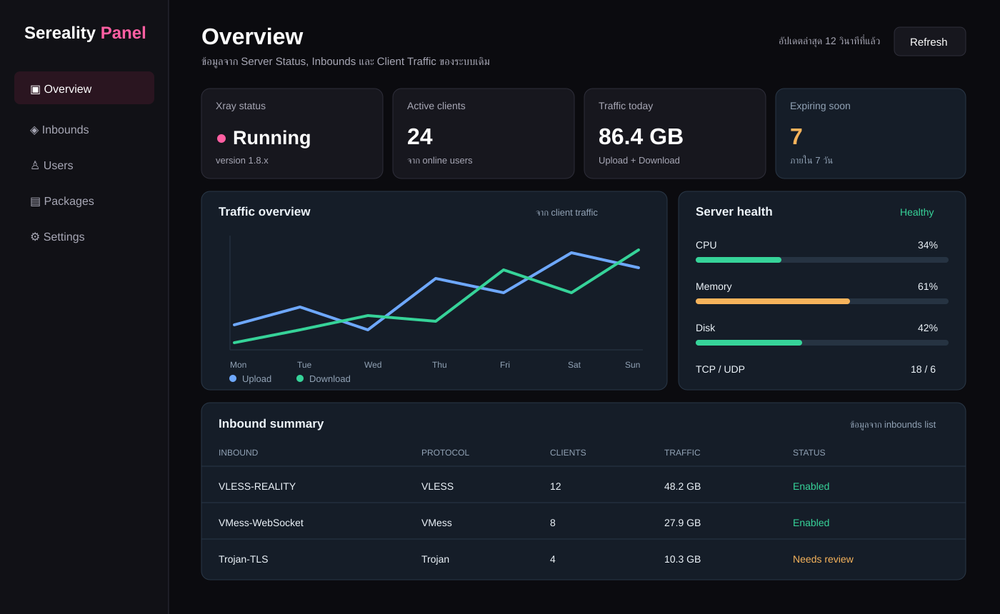

# Sereality Panel

<p align="center">
  
</p>

<p align="center"><strong>Web Panel สำหรับจัดการ Xray ที่เรียบง่าย ปลอดภัย และใช้ธีมชมพู–ขาว–ดำ</strong></p>

<p align="center">
  <a href="https://github.com/natthapon07032005/sereality-panel/releases/tag/v1.0.0"></a>
  <a href="https://github.com/natthapon07032005/sereality-panel/actions/workflows/release.yml"></a>
  <a href="https://github.com/natthapon07032005/sereality-panel/blob/main/LICENSE"></a>
</p>

Sereality Panel คือโปรเจกต์ที่นำโค้ดฐานจาก 3x-ui รุ่นเสถียร `v2.5.5` มาพัฒนาต่อภายใต้ชื่อและทิศทางของ Sereality โดยรุ่นแรกของโปรเจกต์ใช้หมายเลขเวอร์ชัน `v1.0.0` เพื่อแยกจากเวอร์ชันของโค้ดฐานอย่างชัดเจน

> โปรเจกต์นี้จัดทำเพื่อการเรียนรู้ การทดสอบ และการบริหารเซิร์ฟเวอร์ของผู้ดูแลเอง ผู้ใช้ต้องตรวจสอบกฎหมายและนโยบายของผู้ให้บริการก่อนใช้งาน ห้ามนำไปใช้ในทางผิดกฎหมาย

## เวอร์ชันของโปรเจกต์

| รายการ | ค่า |
| --- | --- |
| ชื่อโปรเจกต์ | Sereality Panel |
| รุ่นแรกของ Sereality | `v1.0.0` |
| โค้ดฐาน | 3x-ui `v2.5.5` |
| แกนการทำงาน | Xray Core |
| ระบบที่แนะนำ | Linux 64-bit หรือ ARM ที่รองรับ |

## ภาพรวมหน้าตาเว็บ

หน้า Dashboard ออกแบบให้เป็นโทนดำเป็นพื้น ชมพูเป็นสีเน้น และใช้ตัวอักษรสีขาวเพื่อให้อ่านง่าย ประกอบด้วย:

- แถบเมนูของ Sereality Panel และปุ่มสลับธีม
- การ์ดสรุปสถานะ Xray, ผู้ใช้ที่ใช้งาน, ปริมาณทราฟฟิก และผู้ใช้ใกล้หมดอายุ
- กราฟ Upload/Download และภาพรวมการใช้ทรัพยากรเครื่อง
- สรุป Inbounds, Clients, พอร์ต และสถานะบริการ
- ปุ่มลัดสำหรับรีเฟรช เปิดการตั้งค่า และจัดการบริการ
- รองรับหน้าจอมือถือ แท็บเล็ต และเดสก์ท็อป

ภาพด้านบนเป็นภาพตัวอย่าง UI ของโปรเจกต์ ไฟล์จริงอยู่ที่ [`dashboard-preview.svg`](./dashboard-preview.svg)

## ฟังก์ชันที่มีใน `v1.0.0`

### Dashboard

- ตรวจสถานะ Panel และ Xray แบบรวมในหน้าเดียว
- ดู CPU, RAM, Disk, Uptime และสถานะเครือข่าย
- ดูจำนวน Inbounds, Clients และ Clients ที่ออนไลน์
- ดูทราฟฟิก Upload/Download และผู้ใช้ที่ใกล้หมดอายุ
- รีเฟรชข้อมูลจากเซิร์ฟเวอร์ได้ทันที

### Inbounds และ Clients

- สร้าง แก้ไข เปิด/ปิด และลบ Inbound
- เพิ่ม Client รายคนหรือเพิ่มหลายคนพร้อมกัน
- ค้นหา Inbound และ Client
- ดูทราฟฟิก Upload, Download, รวม และวันหมดอายุ
- ดู Client ที่ออนไลน์และประวัติ IP
- สร้าง QR Code และคัดลอกลิงก์การเชื่อมต่อ
- Export ลิงก์ทั้งหมดหรือลิงก์ Subscription
- Export/Import ข้อมูล Inbound
- Clone Inbound เพื่อนำการตั้งค่าไปสร้างรายการใหม่
- รีเซ็ตทราฟฟิกของ Client, Inbound หรือทั้งหมด
- ลบ Client ที่ใช้ทราฟฟิกครบหรือหมดอายุ
- ตั้งค่า IP Limit ต่อ Inbound

### Protocol ที่รองรับ

Inbound รองรับโปรโตคอลต่อไปนี้:

- VMess
- VLESS
- Trojan
- Shadowsocks
- Dokodemo-door
- SOCKS
- HTTP
- WireGuard

ในส่วนการเชื่อมต่อยังรองรับการตั้งค่า TCP, WebSocket, gRPC, HTTPUpgrade, XHTTP, mKCP, TLS และ REALITY ตามความสามารถของ Xray รุ่นที่ติดตั้ง

### Package และ User Management

- สร้าง แก้ไข และลบแพ็กเกจ
- กำหนดระยะเวลาและเงื่อนไขของแพ็กเกจ
- สร้างและจัดการผู้ใช้ของ Panel
- เปิด/ปิดสถานะผู้ใช้
- ผูกผู้ใช้เข้ากับแพ็กเกจ
- ตรวจสอบข้อมูลผ่านหน้าเว็บหรือ API รุ่นที่ 2

โมดูลนี้เป็นส่วนขยายของ Sereality รุ่นแรก จึงควรทดสอบกับข้อมูลสำรองก่อนใช้งานจริง

### Subscription และ Nodes

- จัดการ Subscription และสถานะการใช้งาน
- กำหนดวันเริ่มต้นและจำนวนวันของ Subscription
- จัดการ Node ที่เชื่อมต่อผ่าน HTTPS
- เก็บ Token ของ Node ในรูปแบบที่ไม่เก็บค่า Token ตรง ๆ
- ตรวจสอบสถานะ Node และข้อมูลการจัดการเบื้องต้น

### Xray Configuration

- แก้ไข Xray configuration ผ่านหน้าเว็บ
- จัดการ Inbound, Outbound, Routing และ Balancer
- ตั้งค่า DNS และ Fake DNS
- ตั้งค่ากฎ Block, Direct, IPv4 และ WARP
- ตั้งค่า Log level, Access log, Error log และ DNS log
- เปิดใช้สถิติทราฟฟิกของ Inbound/Outbound
- สร้าง X25519 key ใหม่สำหรับการตั้งค่า REALITY
- เปลี่ยน Xray version และรีสตาร์ตบริการจากหน้าเว็บ

### Panel Settings

- เปลี่ยนชื่อผู้ใช้ รหัสผ่าน และ Secret สำหรับเข้าสู่ระบบ
- เปลี่ยนพอร์ตของ Panel
- เปลี่ยนหรือสุ่ม Web Base Path
- ตั้งค่า Listen IP และรองรับ SSH Port Forwarding
- เปิด HTTPS ด้วย Certificate และ Private Key
- ตั้งค่า Timezone และจำนวนรายการต่อหน้า
- ตั้งค่า Telegram Bot และการแจ้งเตือน
- ตั้งค่า Subscription service
- Export และ Restore ฐานข้อมูล
- สลับ Light/Dark theme

### เครื่องมือดูแลเซิร์ฟเวอร์

ผ่านคำสั่ง `x-ui` ยังมีเครื่องมือสำหรับ:

- จัดการ SSL ด้วย ACME และ Cloudflare
- จัดการ IP Limit และ Fail2ban
- จัดการ UFW Firewall
- เปิด/ปิด BBR
- อัปเดตไฟล์ GeoIP และ GeoSite
- ดู Debug log และล้าง log
- ทดสอบความเร็วด้วย Ookla Speedtest
- Start, Stop, Restart และดูสถานะ Panel/Xray
- เปิดหรือปิดการเริ่มทำงานอัตโนมัติหลังบูต

## การติดตั้ง

### ติดตั้งรุ่นล่าสุดของ Sereality Panel

คำสั่งนี้จะดาวน์โหลด Release ล่าสุดของ Sereality Panel และตรวจสอบ SHA-256 ก่อนติดตั้ง:

```bash
bash <(curl -Ls https://raw.githubusercontent.com/natthapon07032005/sereality-panel/main/install.sh)
```

### ติดตั้งรุ่นแรก `v1.0.0` แบบระบุเวอร์ชัน

```bash
VERSION=v1.0.0 && bash <(curl -Ls "https://raw.githubusercontent.com/natthapon07032005/sereality-panel/$VERSION/install.sh") $VERSION
```

หลังติดตั้งเสร็จ ให้ดูข้อมูลเข้าสู่ระบบและ URL ด้วย:

```bash
x-ui settings
```

โดยปกติระบบจะสุ่มค่าที่สำคัญให้ในระหว่างติดตั้ง ควรบันทึกชื่อผู้ใช้ รหัสผ่าน พอร์ต และ Web Base Path ไว้ในที่ปลอดภัย

## คำสั่งจัดการ Panel

| คำสั่ง | หน้าที่ |
| --- | --- |
| `x-ui` | เปิดเมนูจัดการแบบโต้ตอบ |
| `x-ui start` | เริ่มบริการ Panel |
| `x-ui stop` | หยุดบริการ Panel |
| `x-ui restart` | รีสตาร์ต Panel และ Xray |
| `x-ui status` | ดูสถานะบริการ |
| `x-ui settings` | แสดงค่าการตั้งค่าปัจจุบัน |
| `x-ui enable` | เปิด Autostart |
| `x-ui disable` | ปิด Autostart |
| `x-ui log` | ดูและจัดการ Log |
| `x-ui banlog` | ดู Log ของ Fail2ban/IP Limit |
| `x-ui update` | อัปเดต Panel |
| `x-ui legacy` | เลือกติดตั้งรุ่นที่ระบุ |
| `x-ui install` | ติดตั้ง Panel |
| `x-ui uninstall` | ถอนการติดตั้ง Panel |

คำสั่ง `x-ui legacy` จะถามหมายเลขเวอร์ชัน เช่น `1.0.0` และจะแปลงเป็น Tag `v1.0.0` ให้อัตโนมัติ ต้องใช้เฉพาะเวอร์ชันที่มีอยู่ใน Release ของ Sereality Panel

## เมนูจัดการแบบโต้ตอบ

เมื่อรัน `x-ui` จะมีเมนูหลักดังนี้:

| เมนู | หน้าที่ |
| ---: | --- |
| 1–5 | Install, Update, Update Menu, Legacy Version, Uninstall |
| 6–10 | รีเซ็ตบัญชี, รีเซ็ต Web Base Path, รีเซ็ต Settings, เปลี่ยนพอร์ต, ดู Settings |
| 11–15 | Start, Stop, Restart, Check Status, Logs Management |
| 16–17 | Enable/Disable Autostart |
| 18–20 | SSL Certificate, Cloudflare SSL, IP Limit |
| 21–22 | Firewall และ SSH Port Forwarding |
| 23–25 | BBR, Geo Files และ Speedtest |

## Backup และ Restore

ฐานข้อมูลหลักอยู่ที่:

```text
/etc/x-ui/x-ui.db
```

สามารถ Backup และ Restore ได้จากหน้าเว็บในส่วนการตั้งค่า โดยไฟล์ Backup เป็นไฟล์ฐานข้อมูล `.db`

คำแนะนำก่อน Restore:

1. ดาวน์โหลด Backup ล่าสุดเก็บไว้นอกเซิร์ฟเวอร์
2. ตรวจสอบว่าไฟล์เป็นของ Sereality Panel เครื่องเดียวกัน
3. หยุดการแก้ไขข้อมูลระหว่าง Restore
4. รีสตาร์ต Panel และตรวจสอบ Inbounds/Clients หลัง Restore

การ Restore ฐานข้อมูลไม่ใช่การย้อนเวอร์ชันของโปรแกรมทั้งชุด หากต้องการย้อนเวอร์ชันของตัวโปรแกรม ให้ใช้ Release ที่ต้องการติดตั้งใหม่

## HTTPS และ Reverse Proxy ด้วย Nginx

ตัวอย่าง Reverse Proxy สำหรับ Panel ที่พอร์ต `2053`:

```nginx
location / {
    proxy_set_header X-Forwarded-For $proxy_add_x_forwarded_for;
    proxy_set_header X-Forwarded-Proto $scheme;
    proxy_set_header Host $http_host;
    proxy_set_header X-Real-IP $remote_addr;
    proxy_set_header Range $http_range;
    proxy_set_header If-Range $http_if_range;
    proxy_redirect off;
    proxy_pass http://127.0.0.1:2053;
}
```

ถ้าใช้ Sub-path ต้องตั้งค่า URI Path ใน Panel ให้ตรงกับ Nginx และ URL ต้องลงท้ายด้วย `/`

## API ที่มีในรุ่นนี้

API ต้องผ่านการเข้าสู่ระบบก่อนใช้งาน

### API สำหรับ Inbounds

Base path:

```text
/panel/api/inbounds
```

เส้นทางหลักที่มีให้ใช้ ได้แก่:

| Method | Path | หน้าที่ |
| --- | --- | --- |
| GET | `/list` | รายการ Inbounds |
| GET | `/get/:id` | รายละเอียด Inbound |
| GET | `/getClientTraffics/:email` | ทราฟฟิกของ Client |
| POST | `/add` | เพิ่ม Inbound |
| POST | `/update/:id` | แก้ไข Inbound |
| POST | `/del/:id` | ลบ Inbound |
| POST | `/addClient` | เพิ่ม Client |
| POST | `/updateClient/:clientId` | แก้ไข Client |
| POST | `/:id/delClient/:clientId` | ลบ Client |
| POST | `/:id/resetClientTraffic/:email` | รีเซ็ตทราฟฟิก Client |
| POST | `/onlines` | รายการ Client ที่ออนไลน์ |

### API รุ่นที่ 2

Base path:

```text
/panel/api/v2
```

รองรับการอ่านและจัดการ `packages`, `users`, `nodes` และ `subscriptions` รวมถึง endpoint `/health`

## ระบบและสถาปัตยกรรมที่รองรับ

สคริปต์ติดตั้งและ Release ปัจจุบันมีแพ็กเกจสำหรับ:

- `amd64`
- `arm64`
- `armv7`
- `armv6`
- `armv5`
- `386`
- `s390x`

ระบบ Linux ที่ควรใช้คือ Ubuntu 20.04+, Debian 11+, CentOS 8+, Fedora 36+, AlmaLinux 8+, Rocky Linux 8+, Oracle Linux 8+, OpenEuler 22.03+, Amazon Linux 2023, Arch Linux, Manjaro, Armbian และ OpenSUSE Tumbleweed ตามความเข้ากันได้ของเครื่อง

## แนวทางความปลอดภัย

- เปลี่ยนชื่อผู้ใช้และรหัสผ่านเริ่มต้นทันที
- ใช้รหัสผ่านยาวและไม่ซ้ำกับบริการอื่น
- ใช้ Web Base Path ที่เดายากและเปิด HTTPS
- จำกัดพอร์ตด้วย Firewall และเปิดเฉพาะพอร์ตที่จำเป็น
- สำรองฐานข้อมูลก่อนแก้ไข Xray หรือ Restore
- จำกัดสิทธิ์ Telegram Bot เฉพาะ Chat ID ของผู้ดูแล
- อัปเดตระบบปฏิบัติการและตรวจสอบ Log เป็นระยะ
- อย่าเผยแพร่ไฟล์ฐานข้อมูล, Certificate, Private Key หรือ Token ลง GitHub

## โครงสร้างหน้าเว็บ

เมนูหลักของ Sereality Panel มีดังนี้:

| หน้า | URL | รายละเอียด |
| --- | --- | --- |
| Dashboard | `/panel/` | ภาพรวมระบบและทรัพยากร |
| Inbounds | `/panel/inbounds` | จัดการ Inbounds และ Clients |
| Packages | `/panel/package-manager` | จัดการแพ็กเกจ |
| Users | `/panel/user-manager` | จัดการผู้ใช้ |
| Subscriptions | `/panel/subscription-manager` | จัดการ Subscription |
| Nodes | `/panel/node-manager` | จัดการ Node |
| Settings | `/panel/settings` | ตั้งค่า Panel และการแจ้งเตือน |
| Xray Configs | `/panel/xray` | ตั้งค่า Xray, Routing และ DNS |

## Roadmap

- เปลี่ยน Branding และปรับความปลอดภัยพื้นฐาน — ดำเนินการแล้ว
- Dashboard และ Package/User management — มีโครงสร้างรุ่นแรกแล้ว
- Multi-node และ API ที่เป็นมาตรฐานมากขึ้น — พัฒนาต่อ
- Subscription, สมาชิก และระบบเชิงพาณิชย์ — อยู่ในแผนระยะถัดไป
- ระบบ Backup/Rollback และการตรวจสอบความปลอดภัยเชิงลึก — พัฒนาต่อเป็นระยะ

## การพัฒนาโปรเจกต์

```bash
git clone https://github.com/natthapon07032005/sereality-panel.git
cd sereality-panel
```

ตรวจสอบโค้ด Go:

```bash
go test ./web/...
```

ตรวจสอบสคริปต์ติดตั้ง:

```bash
bash -n install.sh
bash -n x-ui.sh
bash installer/repository_test.sh
```

## License และเครดิต

Sereality Panel เผยแพร่ภายใต้ [GNU GPL v3](./LICENSE)

โปรเจกต์นี้พัฒนาต่อยอดจาก [3x-ui โดย MHSanaei](https://github.com/MHSanaei/3x-ui) และใช้ Xray Core รวมถึงชุดกฎ GeoIP/GeoSite จากโครงการโอเพนซอร์สที่เกี่ยวข้อง โปรดตรวจสอบ License ของส่วนประกอบแต่ละรายการก่อนนำไปแจกจ่ายต่อ

สำหรับ Source Code, Issue และ Release ให้ดูที่ [GitHub Repository ของ Sereality Panel](https://github.com/natthapon07032005/sereality-panel)
